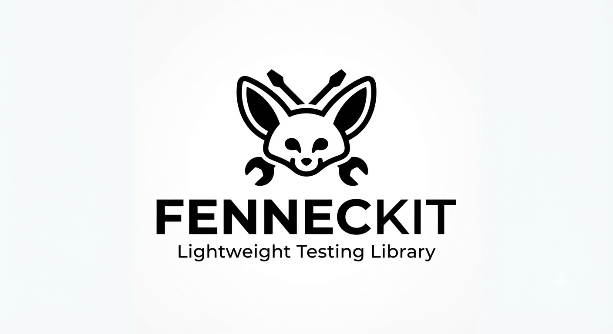

# 🦊 FennecKit: Lab-Based Testing & Development Utility



```bash 
npm install fenneckit@latest --save-dev
npx fenneckit --help
```
**English**: A Complete Storage System for Practical and Seamless Data Analysis

**Zero Config** • Sequential Labs • Inter-Lab Data Sharing (within the same file) • Store Management

**🦊Example** : soon

---

## 🎯 What is FennecKit?

FennecKit is a lightweight, **zero-config** testing & development utility built around the concept of **Labs**.

### What is a "Lab"?

A **Lab** is a collection of sequential tasks (a workflow) that together accomplish one objective.

**Examples**:
- User Registration Lab → create user → validate → save to DB → send email
- Payment Processing Lab → validate → charge → generate invoice
- API Testing Lab → hit endpoints → verify responses → check side effects

```typescript
// Lab = Collection of sequential tasks
await newLabs("User Registration Lab", async (kit) => {
  await kit.test("Validate Email", async () => {
    kit.done("Email validated");
  });

  await kit.test("Save to Database", async () => {
    kit.done("User saved");
  });

  await kit.test("Send Verification Email", async () => {
    kit.done("Email sent");
  });
});
```

---

## ⚡ Zero Config & Runner

FennecKit requires **no configuration files**.

### How to run

```bash
# Run a specific lab file
npx fenneckit lab.js

# Or just
npx fenneckit

# The runner automatically finds all *.labs.js / *.labs.ts files
# and executes them one after another (sequentially)
```

**What the runner does**:
1. Discovers lab files in the current directory (and subdirectories if configured)
2. Runs each file **one by one**
3. Inside each file, Labs run in the order they are written
4. Generates a report (`fenneckit.md`) after execution

> **Important limitation**  
> Data sharing (`setStore` / `getStore`) only works **inside the same file**.  
> Different lab files **cannot** share STORE or TEMP data with each other.

---

## 🌳 Data Sharing Hierarchy (Tree Structure)

```
📁 FennecKit Execution
│
├─ 📄 file1.labs.js (STORE Instance #1)
│  │
│  ├─ 🔬 Lab 1 (User Registration)
│  │  ├─ 📝 Test 1: Create User
│  │  │  ├─ STORE: {"userId": "123"} ✅ Shared with Lab 2
│  │  │  └─ TEMP: {"token": "abc"} ❌ Only here
│  │  │
│  │  └─ 📝 Test 2: Send Email
│  │     └─ Can access STORE from Test 1
│  │
│  ├─ 🔬 Lab 2 (Authentication)
│  │  ├─ 📝 Test 1: Generate Token
│  │  │  ├─ STORE: {"userId": "123"} ✅ From Lab 1
│  │  │  └─ TEMP: {"token": "new"} ❌ Only here
│  │  │
│  │  └─ 📝 Test 2: Verify Token
│  │     └─ Can access STORE from Labs 1 & 2
│  │
│  └─ 🔬 Lab 3 (Cleanup)
│     └─ File STORE cleared when execution ends
│
├─ 📄 file2.labs.js (STORE Instance #2 - ISOLATED)
│  │
│  ├─ 🔬 Lab 1
│  │  └─ ❌ CANNOT access file1.labs.js STORE
│  │
│  └─ 🔬 Lab 2
│     └─ ❌ CANNOT access file1.labs.js STORE
│
└─ 📄 file3.labs.js (STORE Instance #3 - ISOLATED)
   └─ ❌ Isolated from file1.labs.js and file2.labs.js
```

### Understanding the Hierarchy

**🔴 Level 1: Different Files = NO Data Sharing**
```
file1.labs.js  ← STORE Instance #1 (isolated)
file2.labs.js  ← STORE Instance #2 (isolated)
file3.labs.js  ← STORE Instance #3 (isolated)

❌ file1's STORE ≠ file2's STORE ≠ file3's STORE
```

**🟡 Level 2: Same File, Different Labs = STORE Sharing**
```
file1.labs.js
├─ Lab 1: setStore("userId", "123")
├─ Lab 2: getStore("userId")  ✅ Can access
└─ Lab 3: getStore("userId")  ✅ Can still access
```

**🟢 Level 3: Same Lab, Different Tests = STORE + TEMP Sharing**
```
Lab 1 (User Registration)
├─ Test 1: 
│  ├─ setStore("userId", "123")  ✅ Shared with other tests
│  └─ setTemp("token", "abc")    ✅ Shared with other tests in Lab 1
│
├─ Test 2:
│  ├─ getStore("userId")  ✅ Works (from Test 1)
│  └─ getTemp("token")    ✅ Works (from Test 1)
│
└─ Lab 1 ends → TEMP cleared, STORE remains
```

---

## 🔗 Data Communication Between Labs (Inter-Lab Communication)

### The Problem with Jest / Vitest

In Jest and Vitest every test is isolated. You cannot pass data from one test to another.

### FennecKit Solution – Three Storage Levels

```
┌─────────────────────────────────────────────────────────────┐
│         FennecKit Storage System (Per File)                 │
├─────────────────────────────────────────────────────────────┤
│                                                             │
│  LEVEL 1: FILE SCOPE (Entire File)                         │
│  ┌──────────────────────────────────────────────────────┐  │
│  │ STORE (Global - Persistent within file)              │  │
│  │ ├─ Shared across ALL Labs in this file               │  │
│  │ ├─ Available until file execution ends               │  │
│  │ ├─ Can be manually cleared with clearStore()         │  │
│  │ └─ Example: userId, authToken, orderData            │  │
│  └──────────────────────────────────────────────────────┘  │
│                                                             │
│  LEVEL 2: LAB SCOPE (Single Lab)                           │
│  ┌──────────────────────────────────────────────────────┐  │
│  │ STORE (Available to this and following Labs)         │  │
│  │ └─ Set in Lab 1, used in Lab 2, Lab 3, etc          │  │
│  └──────────────────────────────────────────────────────┘  │
│                                                             │
│  LEVEL 3: LAB-LOCAL SCOPE (Single Lab Only)               │
│  ┌──────────────────────────────────────────────────────┐  │
│  │ TEMP (Local - Auto-Cleaned)                          │  │
│  │ ├─ Only available inside current Lab                 │  │
│  │ ├─ Automatically cleared when Lab ends               │  │
│  │ ├─ Cannot be manually cleared                        │  │
│  │ └─ Example: timestamps, temp calculations           │  │
│  └──────────────────────────────────────────────────────┘  │
│                                                             │
└─────────────────────────────────────────────────────────────┘
```

### Storage Demo (same file)

```typescript
// ========== LAB 1: User Registration ==========
await newLabs("User Registration", async (kit) => {
  await kit.test("Create User", async () => {
    const userId = "user_123";
    const email = "john@example.com";

    // STORE → available to all Labs in this file
    kit.setStore("userId", userId);
    kit.setStore("userEmail", email);

    // TEMP → only for this Lab
    kit.setTemp("tempToken", "abc123");

    kit.done("User created");
  });
});

// ========== LAB 2: Authentication ==========
await newLabs("Authentication", async (kit) => {
  await kit.test("Generate Token", async () => {
    const userId = kit.getStore("userId");      // ✅ works (from Lab 1)
    const email = kit.getStore("userEmail");    // ✅ works (from Lab 1)
    const token = kit.getTemp("tempToken");     // ❌ undefined (cleared after Lab 1)

    kit.done(`Token generated for: ${email}`);
  });
});
```

---

## 🧹 NEW: clearStore() Feature (v1.1.0)

Manually clear Store data between Labs for better state management and security.

### Two Ways to Clear

#### 1. Clear specific key (inside Lab)
```typescript
await newLabs("My Lab", async (kit) => {
  await kit.test("Store sensitive data", async () => {
    kit.setStore("authToken", "secret123");
    kit.done("Token stored");
  });

  await kit.test("Cleanup", async () => {
    kit.clearStore("authToken");  // Remove only this key
    kit.done("Token cleared");
  });
});
```

#### 2. Clear all data (global)
```typescript
import { newLabs, clearStore } from "fenneckit";

await newLabs("Lab 1", async (kit) => {
  await kit.test("Setup", async () => {
    kit.setStore("data1", "value1");
    kit.setStore("data2", "value2");
    kit.done("Stored");
  });
});

clearStore();  // Clear all STORE data globally

await newLabs("Lab 2", async (kit) => {
  await kit.test("Fresh Start", async () => {
    const data = kit.getStore("data1");  // undefined
    kit.done("Fresh state");
  });
});
```

### When to Use clearStore()

| Scenario | Method | Why |
|----------|--------|-----|
| Remove sensitive data | `clearStore("token")` | Security |
| Free memory | `clearStore("largeObject")` | Performance |
| Test isolation | `clearStore()` | Prevent data leakage |
| Between phases | `clearStore("tempData")` | Clean state |

---

## 📊 Storage Lifecycle (per file)

```
FILE EXECUTION START
│
├─ Lab 1
│  ├─ setStore(...) → kept across all labs
│  ├─ setTemp(...)  → kept only for this Lab
│  ├─ clearStore(...) → optionally remove keys
│  └─ Lab ends → TEMP cleared, STORE remains (unless cleared)
│
├─ Lab 2
│  ├─ getStore(...) → works (if not cleared)
│  ├─ getTemp(...)  → undefined (cleared after Lab 1)
│  ├─ clearStore(...) → can clear for next labs
│  └─ Lab ends → TEMP cleared, STORE remains (unless cleared)
│
└─ FILE END → STORE completely cleared
```

**Remember**: This lifecycle is **per file**.  
Running `npx fenneckit fileA.labs.js` and then `npx fenneckit fileB.labs.js` gives two completely separate STORE instances.

---

## 💡 Real-World Example (Single File)

```typescript
// order-pipeline.labs.js

import { newLabs, clearStore } from "fenneckit";

// LAB 1
await newLabs("Order Validation", async (kit) => {
  await kit.test("Check Product Stock", async () => {
    kit.setStore("productId", "prod_456");
    kit.setStore("stockAvailable", 50);
    kit.setTemp("validationTime", Date.now());
    kit.done("Product stock verified");
  });
});

// LAB 2
await newLabs("Payment Processing", async (kit) => {
  await kit.test("Charge Customer Card", async () => {
    const productId = kit.getStore("productId");  // ✅ From Lab 1
    const chargeId = `charge_${Date.now()}`;

    kit.setStore("chargeId", chargeId);
    kit.setStore("orderStatus", "paid");
    kit.setTemp("transactionId", chargeId);

    kit.done(`Payment charged: ${chargeId}`);
  });
});

// Clear sensitive payment data before shipping
clearStore("chargeId");

// LAB 3
await newLabs("Shipping & Notification", async (kit) => {
  await kit.test("Create Shipping Label", async () => {
    const status = kit.getStore("orderStatus");    // ✅ Available
    const chargeId = kit.getStore("chargeId");     // ❌ Cleared
    const tempTx = kit.getTemp("transactionId");   // ❌ Undefined

    if (status === "paid") {
      const tracking = `TRACK_${Date.now()}`;
      kit.setStore("trackingNumber", tracking);
      kit.done(`Shipping label created: ${tracking}`);
    }
  });

  await kit.test("Send Notification Email", async () => {
    const tracking = kit.getStore("trackingNumber");
    kit.done(`Email sent with tracking: ${tracking}`);
  });
});
```

Run it:

```bash
npx fenneckit order-pipeline.labs.js
```

---

## 🛠️ LabContext Methods

```typescript
interface LabContext {
  // Testing & Flow
  test(name: string, fn: () => Promise<any>): Promise<any>
  done(msg: string): void
  err(msg: string): void          // stops the Lab
  flatErr(msg: string): void      // continues
  log(msg: string): void
  warning(msg: string): void      // warning

  // Flow control
  out(): void                     // exit Lab immediately
  ret(): void                     // restart Lab

  // Persistent (across Labs in same file)
  setStore(key: string, value: any): void
  getStore(key: string): any
  clearStore(key?: string): void  // NEW: clear specific key or all

  // Temporary (Lab-local only)
  setTemp(key: string, value: any): void
  getTemp(key: string): any
}
```

---

## 🚀 Quick Start

### 1. Create a lab file

```bash
# example.labs.js
```

```typescript
import { newLabs } from "fenneckit";

await newLabs("User Registration Workflow", async (kit) => {
  kit.log("Starting user registration...");

  await kit.test("Create User", async () => {
    const id = "user_" + Date.now();
    kit.setStore("userId", id);
    kit.done(`User created: ${id}`);
  });

  await kit.test("Send Welcome Email", async () => {
    const id = kit.getStore("userId");
    kit.done(`Email sent to user: ${id}`);
  });
});
```

### 2. Run

```bash
npx fenneckit example.labs.js
```

### 3. Check report

```bash
cat fenneckit.md
```

---

## 📋 setStore vs setTemp vs clearStore

| Scenario | Use | Why |
|----------|-----|-----|
| Pass data between Labs | `setStore` | Survives Lab end |
| Performance timing | `setTemp` | Only needed inside one Lab |
| Auth token / DB connection | `setStore` | Needed by multiple Labs |
| Temporary calculation | `setTemp` | Auto-cleaned |
| Remove sensitive data | `clearStore` | Security |
| Reset before next phase | `clearStore` | Fresh state |
| Cross-file sharing | ❌ Impossible | STORE is scoped to one file only |

---

## 🎯 Best Practices

1. **Clear names**
   ```typescript
   kit.setStore("userId", id);
   kit.setStore("authToken", token);
   ```

2. **Always check before use**
   ```typescript
   const userId = kit.getStore("userId");
   if (!userId) {
     kit.err("userId missing from previous Lab!");
   }
   ```

3. **Clear sensitive data**
   ```typescript
   kit.clearStore("password");
   kit.clearStore("creditCard");
   ```

4. **One concern per Lab**  
   Keep each Lab focused. Use STORE to pass only the necessary data.

5. **Do not rely on cross-file data**  
   If you need data from another file, write it to disk or a database yourself.

---

## 🔄 Complete Multi-Lab Example (Payment → Invoice)

```typescript
import { newLabs, clearStore } from "fenneckit";

await newLabs("Payment Validation", async (kit) => {
  await kit.test("Validate Payment Details", async () => {
    kit.setStore("customerId", "cust_123");
    kit.setStore("amount", 299.99);
    kit.setStore("currency", "USD");
    kit.setTemp("validatedAt", Date.now());
    kit.done("Payment validated: 299.99 USD");
  });
});

await newLabs("Process Charge", async (kit) => {
  await kit.test("Charge Card", async () => {
    const amount = kit.getStore("amount");
    const chargeId = `charge_${Date.now()}`;
    kit.setStore("chargeId", chargeId);
    kit.setStore("chargedAt", new Date().toISOString());
    kit.done(`Charged: ${chargeId} for ${amount}`);
  });
});

// Clear payment details (security)
clearStore("chargeId");

await newLabs("Generate Invoice", async (kit) => {
  await kit.test("Create Invoice PDF", async () => {
    const invoiceId = `inv_${Date.now()}`;
    kit.setStore("invoiceId", invoiceId);
    kit.done(`Invoice created: ${invoiceId}`);
  });

  await kit.test("Send Invoice Email", async () => {
    const invoiceId = kit.getStore("invoiceId");
    const customerId = kit.getStore("customerId");
    kit.done(`Invoice ${invoiceId} emailed to ${customerId}`);
  });
});
```

Run:

```bash
npx fenneckit payment-pipeline.labs.js
```

---

## 📞 Troubleshooting

**Q: Lab 2 cannot see Lab 1 data?**  
A: You used `setTemp`. Switch to `setStore`.

**Q: I cleared data but it's still there?**  
A: Make sure you're using `clearStore()` correctly. Check key name.

**Q: Can STORE survive across different files?**  
A: No. Each file execution has its own isolated STORE.  
`npx fenneckit a.labs.js` and `npx fenneckit b.labs.js` do not share data.

**Q: How is TEMP cleaned?**  
A: Automatically when the Lab finishes. No manual cleanup needed.

**Q: How do I run multiple files?**  
A:  
```bash
npx fenneckit file1.labs.js
npx fenneckit file2.labs.js
# or let the runner discover all *.labs.* files
npx fenneckit
```

---

## 🎨 Color / Status Legend

- `✅` / `🟢` Success  
- `❌` / `🔴` Failed (Lab continues)  
- `🛑` Error (Lab stops)  
- `⚠️` / `🟡` Warning  
- `📝` / `⚪` Info  
- `⚙️` Store operation  
- `⏱️` Temp operation  
- `🧹` Clear operation  

---

## 💪 Perfect For

- Backend API testing (Express, Fastify, etc.)
- Database migration validation
- CLI tool workflows
- Microservice chaining
- Pre-deployment smoke checks
- Development-time sanity tests
- State management testing
- Data pipeline validation

---

## 📝 Version History

### v1.0.0-beta (Current)
- ✨ Added `clearStore()` for store management
- 🌳 Improved data sharing hierarchy documentation
- 🧹 Better state cleanup capabilities

### v1.0.0 (Initial Release)
- Core Lab functionality
- STORE & TEMP storage
- Zero config runner
- Report generation

---

## 📝 License

**Copyright © 2026 Lasith Ruwantha Amrwansha**  
Written: 2026/09/17  
Updated: 2026/09/20  
Author: Ruwantha Amrwansha  
Library: FennecKit 🦊

---

**Happy Testing! 🦊⚡**
