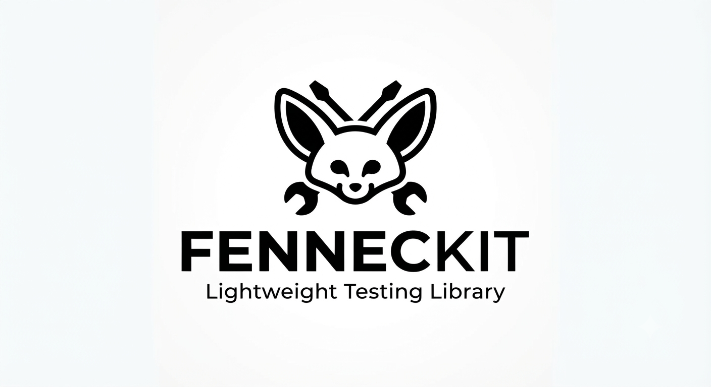

# 🦊 FennecKit



<div align="center">

[](https://www.npmjs.com/package/fenneckit)
[](https://www.npmjs.com/package/fenneckit)

[](https://nodejs.org/)
[](https://www.typescriptlang.org/)
[](LICENSE)

[](#)

**Lab-Based Testing & Development Utility**

Sequential Tests That Share Data • Zero Config • Encrypted Secrets • API Testing Kit

[📖 Learn](#-what-is-fenneckit) • [⚡ Quick Start](#-quick-start) • [💡 Examples](#-real-world-example) • [🛠️ API](#-available-methods)

</div>

---

## 🎯 The Problem FennecKit Solves

### ❌ Problem: Jest/Vitest Tests Are Isolated

```typescript
// With Jest/Vitest:
describe("User API", () => {
  test("Create User", () => {
    // Create user → returns userId
  });

  test("Get User", () => {
    // ❌ How do we get the userId from the first test?
    // We CAN'T! Every test starts fresh.
  });
});
```

**Result:** Complex workflows become impossible. You either:
1. Mock everything (unrealistic)
2. Duplicate data in each test (messy)
3. Write separate test files (hard to maintain)

---

### ✅ Solution: FennecKit Labs

```typescript
import { newLabs } from "fenneckit";

await newLabs("User API", async (kit) => {
  await kit.test("Create User", async () => {
    const res = await kit.http.post("/users", { name: "John" });
    
    // ✅ Save userId for next test
    kit.setStore("userId", res.data.id);
    
    kit.done("User created");
  });

  await kit.test("Get User", async () => {
    // ✅ Access userId from previous test
    const userId = kit.getStore("userId");
    const res = await kit.http.get(`/users/${userId}`);
    
    kit.done("User retrieved");
  });

  await kit.test("Delete User", async () => {
    // ✅ Still have access to userId
    const userId = kit.getStore("userId");
    await kit.http.delete(`/users/${userId}`);
    
    kit.done("User deleted");
  });
});
```

**Result:** Tests flow naturally, sharing data like real workflows! 🎉

---

## 🎯 What is FennecKit?

FennecKit is a lightweight testing utility where:

- **Lab** = A collection of sequential tests working toward one goal
- **Tests** = Individual steps that execute one after another
- **Storage** = Shared across all tests in the same Lab
- **Zero Config** = No configuration files needed

### Real-World Labs

```
🔬 Lab: User Registration Flow
├─ Test 1: Validate Email
├─ Test 2: Create User in DB
├─ Test 3: Send Verification Email
└─ Test 4: Verify Email Works

🔬 Lab: Payment Processing
├─ Test 1: Validate Card
├─ Test 2: Charge Card
├─ Test 3: Generate Invoice
└─ Test 4: Send Receipt Email

🔬 Lab: API Integration
├─ Test 1: GET /users
├─ Test 2: POST /orders
├─ Test 3: GET /orders/{id}
└─ Test 4: DELETE /orders/{id}
```

---

## ⚡ Quick Start

### 1️⃣ Install

```bash
npm install fenneckit@latest --save-dev
```

### 2️⃣ Create a Lab File

Create `user.labs.js` in your project:

```typescript
import { newLabs } from "fenneckit";

await newLabs("User API Test", async (kit) => {
  await kit.test("Step 1: Create User", async () => {
    kit.setStore("userId", "usr_123");
    kit.done("Stored user ID");
  });

  await kit.test("Step 2: Read User", async () => {
    const userId = kit.getStore("userId");
    kit.log(`Using user: ${userId}`);
    kit.done("Retrieved user");
  });
});
```

### 3️⃣ Run

```bash
# Auto-discover and run all .labs.js files
npx fenneckit

# Or run a specific file
npx fenneckit user.labs.js
```

---

## 🗂️ Understanding Storage (The Core Concept)

FennecKit has **4 storage levels**, each with different purposes:

### 📊 Storage Comparison

```
┌─────────────────────────────────────────────────────────────┐
│  STORAGE LEVEL       │ USE FOR              │ CLEARED WHEN     │
├─────────────────────────────────────────────────────────────┤
│  🟢 STORE            │ User IDs, Order IDs   │ File ends        │
│  🔐 SECRET           │ Tokens, Passwords     │ File ends        │
│  🗂️ NAMESPACE        │ Grouped data          │ File ends        │
│  ⏱️ TEMP             │ Temporary values      │ Test/lab ends    │
└─────────────────────────────────────────────────────────────┘
```

---

## 🟢 Level 1: STORE (Shared Persistent Data)

Use STORE to save data that all tests need:

```typescript
await newLabs("E-Commerce", async (kit) => {
  // Test 1: Create User
  await kit.test("Create User", async () => {
    const res = await kit.http.post("/users", {
      name: "Alice",
      email: "alice@example.com"
    });

    // ✅ Save for other tests
    kit.setStore("userId", res.data.id);
    kit.setStore("email", res.data.email);

    kit.done("User created");
  });

  // Test 2: Create Order (uses userId from Test 1)
  await kit.test("Create Order", async () => {
    const userId = kit.getStore("userId"); // ← Get from previous test
    
    const res = await kit.http.post("/orders", {
      userId: userId,
      items: [{ productId: "prod_1", qty: 2 }]
    });

    kit.setStore("orderId", res.data.id); // ← Save for next test

    kit.done("Order created");
  });

  // Test 3: Get Order (uses orderId from Test 2)
  await kit.test("Verify Order", async () => {
    const orderId = kit.getStore("orderId"); // ← Get from previous test
    
    const res = await kit.http.get(`/orders/${orderId}`);
    
    if (res.status === 200) {
      kit.done("Order verified");
    } else {
      kit.err("Order verification failed");
    }
  });
});
```

**Key Points:**
- `kit.setStore(key, value)` → Save data
- `kit.getStore(key)` → Read data
- `kit.clearStore(key)` → Delete data
- Data persists until file ends

---

## 🔐 Level 2: SECRET (Encrypted Storage)

Never store passwords or tokens in plain STORE! Use SECRET instead:

```typescript
await newLabs("Authentication", async (kit) => {
  await kit.test("Login", async () => {
    const res = await kit.http.post("/login", {
      username: "john",
      password: "secure123"
    });

    // ❌ WRONG:
    // kit.setStore("token", res.data.accessToken);

    // ✅ CORRECT: Use SECRET for sensitive data
    kit.setSecret("accessToken", res.data.accessToken);
    kit.setSecret("refreshToken", res.data.refreshToken);

    kit.done("Logged in");
  });

  await kit.test("Use Token", async () => {
    // ✅ Automatically decrypted when you read it
    const token = kit.getSecret("accessToken");
    
    // Use token for requests
    kit.http.setAuth("bearer", token!);
    
    const res = await kit.http.get("/profile");
    kit.done("Retrieved profile");
  });

  await kit.test("Cleanup", async () => {
    // ✅ Remove sensitive data when done
    kit.clearSecret("accessToken");
    kit.clearSecret("refreshToken");
    
    kit.done("Secrets cleared");
  });
});
```

**Why SECRET?**
- ✅ Encrypted at rest (AES-256-GCM)
- ✅ Never logged in plain text
- ✅ Safe for CI/CD pipelines
- ✅ Audit trail of all access

---

## 🗂️ Level 3: NAMESPACE (Organized Groups)

Group related data by namespace instead of scattered keys:

```typescript
await newLabs("Multi-Entity Data", async (kit) => {
  // Create namespaces for different entities
  const user = kit.namespace("user");
  const order = kit.namespace("order");
  const payment = kit.namespace("payment");

  await kit.test("Populate Namespaces", async () => {
    // User namespace
    user.set("id", "usr_123");
    user.set("name", "Alice");
    user.set("email", "alice@example.com");

    // Order namespace
    order.set("id", "ord_456");
    order.set("total", 299.99);
    order.set("status", "pending");

    // Payment namespace
    payment.set("cardId", "card_789");
    payment.set("method", "credit_card");

    kit.done("Namespaces populated");
  });

  await kit.test("Read from Namespaces", async () => {
    // Clean, organized access
    const userName = user.get("name");
    const orderTotal = order.get("total");
    const paymentMethod = payment.get("method");

    kit.log(`${userName} ordered $${orderTotal} using ${paymentMethod}`);
    kit.done("Data organized");
  });
});
```

**Benefits:**
- ✅ Clear data organization
- ✅ No key name conflicts
- ✅ Easy to understand relationships
- ✅ Better for large workflows

---

## ⏱️ Level 4: TEMP (Lab-Local Temporary Data)

Use TEMP for data that's only needed within one test. It's automatically cleared after each test:

```typescript
await kit.test("Measure Performance", async () => {
  // Store start time in TEMP
  kit.setTemp("startTime", Date.now());

  // Simulate work
  await kit.http.get("/api/heavy-endpoint");

  // Calculate elapsed time
  const elapsed = Date.now() - kit.getTemp("startTime");
  kit.log(`Request took ${elapsed}ms`);

  // ✅ TEMP is automatically cleared when test ends
  // Next test won't have access to this data
  kit.done("Performance test complete");
});
```

---

## 📡 HTTP Kit (Built-in API Testing)

FennecKit has a built-in HTTP client with auth, retry, and history tracking:

```typescript
await newLabs("API Smoke Test", async (kit) => {
  // Set auth once for all requests
  kit.http.setAuth("bearer", "your-api-token-here");

  await kit.test("GET Endpoint", async () => {
    const res = await kit.http.get("https://api.example.com/users", {
      timeout: 5000,
      retry: { max: 3, delay: 1000 }
    });

    if (res.status !== 200) {
      kit.err(`Expected 200, got ${res.status}`);
    }

    kit.setStore("userCount", res.data.length);
    kit.done(`Fetched ${res.data.length} users`);
  });

  await kit.test("POST Endpoint", async () => {
    const res = await kit.http.post("https://api.example.com/orders", {
      productId: "prod_1",
      quantity: 2
    });

    kit.setStore("orderId", res.data.id);
    kit.done(`Order created: ${res.data.id}`);
  });

  await kit.test("Check Request History", async () => {
    const history = kit.http.getRequestHistory();
    const last = kit.http.getLastRequest();

    kit.log(`Total requests: ${history.length}`);
    kit.log(`Last request took ${last?.duration}ms`);
    kit.done("History checked");
  });
});
```

**HTTP Methods:**
- `kit.http.get(url, options)`
- `kit.http.post(url, body, options)`
- `kit.http.put(url, body, options)`
- `kit.http.patch(url, body, options)`
- `kit.http.delete(url, options)`

**Auth Methods:**
- `kit.http.setAuth("bearer", token)`
- `kit.http.setAuth("basic", credentials)`
- `kit.http.setAuth("api-key", key)`
- `kit.http.clearAuth()`

---

## 📋 Audit Log (Track Everything)

Every operation on STORE and SECRET is automatically logged:

```typescript
await newLabs("Audit Demo", async (kit) => {
  await kit.test("Do Stuff", async () => {
    kit.setStore("userId", "123");
    kit.setSecret("token", "secret");
    kit.getStore("userId");
    kit.clearStore("userId");
  });

  await kit.test("Review Audit", async () => {
    // Get last 5 operations
    const last5 = kit.audit.getLast(5);

    // Find all operations on "token" key
    const tokenOps = kit.audit.filterByKey("token");

    // Export as JSON or CSV
    const json = kit.audit.export("json");
    const csv = kit.audit.export("csv");

    kit.log(`${last5.length} operations recorded`);
    kit.done("Audit reviewed");
  });
});
```

**Perfect for:**
- 🔍 Debugging complex workflows
- ✅ Compliance & audit trails
- 📊 Performance analysis
- 🔐 Security investigations

---

## ⏰ TTL (Time-To-Live)

Auto-expire data after a certain time:

```typescript
await kit.test("Session Expiry", async () => {
  // This data expires after 30 seconds
  kit.setStoreWithTTL("sessionId", "sess_123", 30_000);
  
  // This secret expires after 60 seconds
  kit.setSecretWithTTL("tempToken", "token", 60_000);

  kit.done("Data with TTL set");
});
```

---

## 🛠️ Available Methods

### Testing & Flow Control
```typescript
// Tests
await kit.test(name, async () => { ... })  // Run a test
kit.done(msg)                              // Test passed
kit.err(msg)                               // Test failed (stop lab)
kit.flatErr(msg)                           // Test failed (continue)
kit.log(msg)                               // Log message
kit.warning(msg)                           // Log warning

// Flow
kit.out()                                  // Exit lab immediately
kit.ret()                                  // Restart lab (max 3x)
```

### STORE (Persistent Data)
```typescript
kit.setStore(key, value)                   // Save data
kit.getStore(key)                          // Read data
kit.clearStore(key)                        // Clear specific key
kit.clearStore()                           // Clear all
kit.setStoreWithTTL(key, value, ms)        // Save with expiry
```

### SECRET (Encrypted Data)
```typescript
kit.setSecret(key, value)                  // Save securely
kit.getSecret(key)                         // Read securely
kit.clearSecret(key)                       // Clear specific
kit.clearSecret()                          // Clear all
kit.setSecretWithTTL(key, value, ms)       // Save with expiry
```

### NAMESPACE (Grouped Data)
```typescript
const ns = kit.namespace(name)             // Create/get namespace
ns.set(key, value)                         // Save to namespace
ns.get(key)                                // Read from namespace
kit.getNamespace(name)                     // Get existing namespace
```

### TEMP (Lab-Local Data)
```typescript
kit.setTemp(key, value)                    // Save temp data
kit.getTemp(key)                           // Read temp data
// Automatically cleared when test ends
```

### HTTP
```typescript
kit.http.get/post/put/patch/delete(url, options)
kit.http.setAuth(type, credentials)
kit.http.clearAuth()
kit.http.getRequestHistory()
kit.http.getLastRequest()
kit.http.clearHistory()
```

### Audit Log
```typescript
kit.audit.getLast(count)                   // Get recent operations
kit.audit.filterByKey(key)                 // Find by key
kit.audit.export("json" | "csv")           // Export audit trail
```

---

## 💡 Real-World Example

```typescript
import { newLabs } from "fenneckit";

await newLabs("Complete E-Commerce Flow", async (kit) => {
  const user = kit.namespace("user");
  const order = kit.namespace("order");

  // Step 1: Register User
  await kit.test("Register User", async () => {
    const res = await kit.http.post("https://api.shop.com/auth/register", {
      email: "test@example.com",
      password: "secure123",
      name: "John Doe"
    });

    if (res.status !== 201) {
      kit.err("User registration failed");
    }

    // Store user data
    user.set("id", res.data.userId);
    user.set("email", res.data.email);

    // Store token securely
    kit.setSecret("accessToken", res.data.token);
    kit.http.setAuth("bearer", res.data.token);

    kit.done("User registered successfully");
  });

  // Step 2: Create Order
  await kit.test("Create Order", async () => {
    const userId = user.get("id");

    const res = await kit.http.post("https://api.shop.com/orders", {
      userId: userId,
      items: [
        { productId: "prod_laptop", quantity: 1, price: 999.99 },
        { productId: "prod_mouse", quantity: 2, price: 29.99 }
      ]
    });

    if (res.status !== 201) {
      kit.err("Order creation failed");
    }

    order.set("id", res.data.orderId);
    order.set("total", res.data.total);
    order.set("status", "pending");

    kit.done(`Order created: ${res.data.orderId}`);
  });

  // Step 3: Process Payment
  await kit.test("Process Payment", async () => {
    const orderId = order.get("id");
    const total = order.get("total");

    const res = await kit.http.post("https://api.shop.com/payments", {
      orderId: orderId,
      amount: total,
      method: "credit_card",
      cardToken: "tok_visa_123"
    });

    if (res.status !== 200 || !res.data.success) {
      kit.err("Payment failed");
    }

    kit.setStore("paymentId", res.data.transactionId);
    order.set("status", "paid");

    kit.done("Payment processed");
  });

  // Step 4: Verify Order
  await kit.test("Verify Order", async () => {
    const orderId = order.get("id");

    const res = await kit.http.get(`https://api.shop.com/orders/${orderId}`);

    if (res.status !== 200) {
      kit.err("Order not found");
    }

    if (res.data.status !== "paid") {
      kit.flatErr("Order status mismatch");
    }

    kit.done("Order verified successfully");
  });

  // Step 5: Send Confirmation Email
  await kit.test("Send Confirmation", async () => {
    const email = user.get("email");
    const orderId = order.get("id");

    const res = await kit.http.post(
      "https://api.shop.com/emails/send",
      {
        to: email,
        subject: "Order Confirmation",
        orderId: orderId
      }
    );

    if (res.status !== 200) {
      kit.flatErr("Email send failed (non-blocking)");
    } else {
      kit.done("Confirmation email sent");
    }
  });

  // Step 6: Cleanup
  await kit.test("Security Cleanup", async () => {
    kit.clearSecret("accessToken");
    kit.http.clearAuth();

    // Check audit log
    const audit = kit.audit.getLast(10);
    kit.log(`${audit.length} operations in audit log`);

    kit.done("Cleanup complete");
  });
});
```

**Output:**
```
✅ Register User → User registered successfully
✅ Create Order → Order created: ord_12345
✅ Process Payment → Payment processed
✅ Verify Order → Order verified successfully
✅ Send Confirmation → Confirmation email sent
✅ Security Cleanup → Cleanup complete

🎉 Lab: Complete E-Commerce Flow → PASSED
```

---

## 📊 Data Sharing Rules

### ✅ Shared Across Tests in Same File?

| Storage | Test 1 → Test 2 | File 1 → File 2 |
|---------|-----------------|-----------------|
| STORE | ✅ Yes | ❌ No |
| SECRET | ✅ Yes | ❌ No |
| NAMESPACE | ✅ Yes | ❌ No |
| TEMP | ❌ No | ❌ No |

**Key Rule:** Each `.labs.js` file gets its own isolated storage.

---

## 🎯 Best Practices

### ✅ 1. Use STORE for Regular Data
```typescript
kit.setStore("userId", "123");           // ✅ Good
kit.setStore("userName", "Alice");       // ✅ Good
```

### ✅ 2. Use SECRET for Sensitive Data
```typescript
kit.setSecret("accessToken", token);     // ✅ Good
kit.setSecret("refreshToken", refresh);  // ✅ Good
kit.setStore("accessToken", token);      // ❌ Wrong!
```

### ✅ 3. Use NAMESPACE for Organization
```typescript
const user = kit.namespace("user");
user.set("id", id);
user.set("email", email);
// NOT:
// kit.setStore("userId", id);
// kit.setStore("userEmail", email);
```

### ✅ 4. Check Before Using
```typescript
const token = kit.getSecret("token");
if (!token) {
  kit.err("Token is missing!");
}
```

### ✅ 5. Clean Up Secrets
```typescript
await kit.test("Final", async () => {
  kit.clearSecret("accessToken");
  kit.clearSecret("refreshToken");
  kit.done("Secrets cleared");
});
```

### ✅ 6. Use Audit for Compliance
```typescript
const audit = kit.audit.export("json");
console.log(audit); // For compliance or debugging
```

---

## 💪 Perfect For

| Scenario | Why FennecKit? |
|----------|----------------|
| 🔌 **API Testing** | Tests share data, workflow is natural |
| 🔐 **Security Tests** | Built-in encryption for secrets |
| 📚 **Database Migration** | Validate data flows step-by-step |
| 🔗 **Microservices** | Chain service calls naturally |
| 🚀 **Pre-deployment** | Smoke testing with real state |
| 📊 **Data Pipelines** | Validate ETL workflows |
| 🧪 **Integration Tests** | Multi-step complex scenarios |

---

## 🚀 Features at a Glance

| Feature | What It Does |
|---------|-------------|
| 🔬 **Labs** | Group related tests into workflows |
| 📦 **STORE** | Persistent data across tests |
| 🔐 **SECRET** | Encrypted storage for sensitive data |
| 🗂️ **NAMESPACE** | Organize data by entity |
| ⏱️ **TEMP** | Lab-local temporary data |
| 📡 **HTTP Kit** | Built-in API testing client |
| 📋 **Audit Log** | Track all data operations |
| ⏰ **TTL** | Auto-expire data after time |
| 🔄 **Retries** | Built-in HTTP retry logic |
| 📊 **Export** | Audit log to JSON/CSV |

---

## 📝 Version History

### v1.2.0 (Current)
- 🔐 Secret Vault (AES-256-GCM encryption)
- 🗂️ Namespaced Store
- 📋 Audit Log (JSON/CSV export)
- 📡 HTTP Kit with auth & retry
- ⏰ TTL support for STORE & Secrets
- Improved LabContext API

### v1.1.0
- ✨ Added `clearStore()` for store management
- 🌳 Improved data sharing hierarchy documentation

### v1.0.0
- Core Lab functionality
- Basic STORE & TEMP storage
- Zero config runner
- Report generation

---

## 📝 License

**Copyright © 2026 Lasith Ruwantha Amrwansha**

Written: 2026/09/17  
Updated: 2026/09/21  
Author: Ruwantha Amrwansha  
Library: FennecKit 🦊

---

<div align="center">

**Happy Testing! 🦊⚡**

Made with ❤️ for developers who want simpler, more natural testing

</div>
